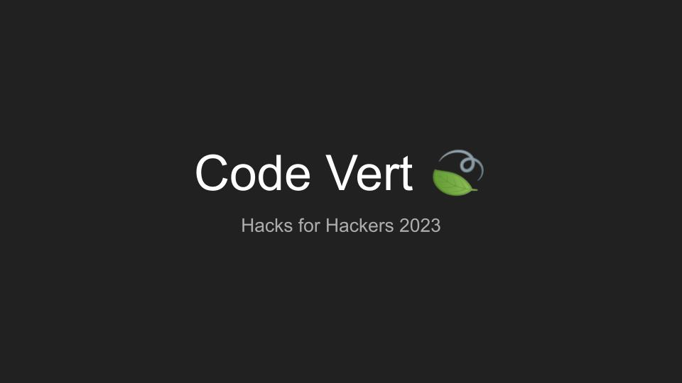

# Code Vert 🍃

Code Vert provides feedback on the environmental impact of hackathon projects and proposes strategies for risk mitigation. Contestants can gain a competitive advantage by using the Demo Assets feature to write their Devpost pages and compose their demo presentation video.

* assess and address the environmental risks of your projects 🍃
* optimize your time distribution between building and presenting ⏰
* perform better in the final judging 👑

<em>Good code is green code.</em>

